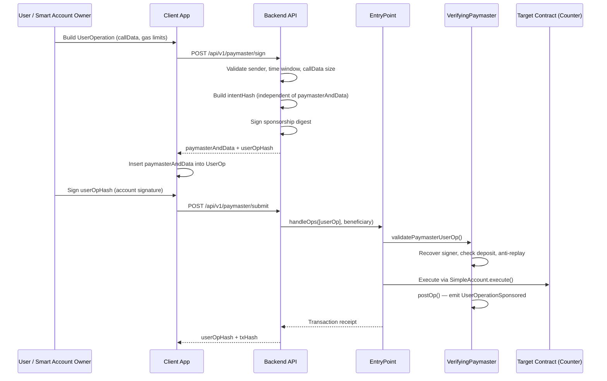

# Paymaster Project — Gasless ERC-4337 Transactions

A full-stack **Account Abstraction (ERC-4337)** paymaster system that lets smart-account users execute on-chain transactions **without holding ETH for gas**. A trusted off-chain backend signs sponsorship approvals; the on-chain `VerifyingPaymaster` contract validates those signatures and pays gas from its EntryPoint deposit.

---

## Table of Contents

- [What This Project Does](#what-this-project-does)
- [Architecture & Process Flow](#architecture--process-flow)
- [Repository Structure](#repository-structure)
- [Features](#features)
- [Problems Encountered & Solutions](#problems-encountered--solutions)
- [Prerequisites](#prerequisites)
- [Quick Start](#quick-start)
- [How to Test](#how-to-test)
- [Backend API Reference](#backend-api-reference)
- [Deployed Contract Addresses (Local)](#deployed-contract-addresses-local)
- [Configuration Reference](#configuration-reference)
- [Security Notes](#security-notes)

---

## What This Project Does

Traditional Ethereum transactions require the sender to pay gas in native ETH. This project removes that requirement for end users by implementing the **Verifying Paymaster** pattern from ERC-4337:

1. A user builds a **UserOperation** (a bundled intent to execute a call through their smart account).
2. The **backend** reviews the operation and, if allowed, signs a sponsorship authorization.
3. The user signs the final UserOperation hash with their smart-account owner key.
4. A **bundler** (the backend in dev mode) submits the operation to the canonical **EntryPoint** contract.
5. The **VerifyingPaymaster** contract validates the backend's signature and pays gas from its pre-funded deposit.

The demo target contract is a simple `Counter` — a gasless `inc()` call increments the counter without the user spending ETH.

---

## Architecture & Process Flow



### Signing Order (Critical)

The gasless flow depends on a strict two-signature sequence:

| Step | Who Signs | What Is Signed |
|------|-----------|----------------|
| 1 | Backend (verifying signer) | **Intent hash** — stable UserOp fields + validity window + chainId (does **not** include `paymasterAndData`) |
| 2 | Smart account owner | **Full userOpHash** — canonical ERC-4337 v0.7 hash that **includes** the finalized `paymasterAndData` |

The backend returns `userOpHash` already computed with the real `paymasterAndData`, so the client can produce the account signature in one step.

---

## Repository Structure

```
paymaster-project/
├── README.md                          # This file — project-wide documentation
│
├── backend/                           # Off-chain paymaster signing & bundler service
│   ├── src/
│   │   ├── index.ts                   # Express app entry point
│   │   ├── config/
│   │   │   ├── env.ts                 # Environment validation (Zod)
│   │   │   └── viemClients.ts         # Public + wallet viem clients
│   │   ├── controllers/
│   │   │   └── paymasterController.ts # sign, submit, status, compute-hash handlers
│   │   ├── routes/
│   │   │   └── paymasterRoutes.ts     # /api/v1/paymaster/* routes
│   │   ├── services/
│   │   │   ├── signerService.ts       # Hashing, signing, paymasterAndData builder
│   │   │   └── validationService.ts   # Allowlist, time window, callData size checks
│   │   ├── middleware/
│   │   │   ├── errorHandler.ts        # Structured error responses
│   │   │   ├── rateLimiter.ts         # Global + per-wallet rate limits
│   │   │   └── requestLogger.ts       # Request ID + structured logging
│   │   ├── types/
│   │   │   └── userOperation.ts       # PackedUserOperation + API response types
│   │   └── utils/
│   │       └── logger.ts              # Winston JSON logger
│   ├── .env.example                   # Environment template
│   └── package.json
│
└── paymaster/                         # On-chain contracts, tests, deployments
    ├── contracts/
    │   ├── VerifyingPaymaster.sol     # Core paymaster — validates off-chain signatures
    │   ├── RealEntryPoint.sol         # Wrapper around canonical AA EntryPoint
    │   ├── RealSimpleAccountFactory.sol # Wrapper for SimpleAccountFactory
    │   ├── Counter.sol                # Demo target contract
    │   ├── EntryPoint.sol             # Compile-time import of AA EntryPoint
    │   ├── interfaces/
    │   │   └── IVerifyingPaymaster.sol
    │   └── mocks/
    │       └── EntryPointMock.sol     # Lightweight mock for unit tests
    ├── test/
    │   ├── VerifyingPaymaster.ts      # Full integration tests (mock + real EntryPoint)
    │   ├── Counter.ts                 # Counter contract tests
    │   └── helpers/
    │       └── userOpBuilder.ts       # UserOperation construction helpers
    ├── ignition/
    │   ├── modules/
    │   │   ├── VerifyingPaymaster.ts  # Deployment module (EP + Factory + Paymaster)
    │   │   └── parameters.json        # Signer/owner addresses for deployment
    │   └── deployments/
    │       └── chain-31337/
    │           └── deployed_addresses.json
    ├── scripts/
    │   └── send-op-tx.ts              # OP chain type demo script
    ├── hardhat.config.ts
    └── package.json
```

---

## Features

### On-Chain (`paymaster/`)

| Feature | Description |
|---------|-------------|
| **VerifyingPaymaster** | ERC-4337 paymaster that sponsors UserOperations authorized by an off-chain ECDSA signer |
| **Intent-based signing** | Sponsorship digest uses stable operation fields, avoiding circular hash dependency |
| **ERC-4337 v0.7 `paymasterAndData` layout** | Correct 20 + 32 + 6 + 6 + 65 byte structure with paymaster gas limits |
| **Replay protection** | Tracks used `userOpHash` values to prevent double-spend of sponsorship |
| **Time-bounded sponsorship** | `validAfter` / `validUntil` window enforced on-chain |
| **Deposit management** | Owner can deposit/withdraw ETH from the EntryPoint for the paymaster |
| **Signer rotation** | Owner can update the verifying signer address |
| **Real EntryPoint integration** | Full end-to-end test via `handleOps` with counterfactual SimpleAccount deployment |
| **SimpleAccountFactory** | Deploy smart accounts on-the-fly via `initCode` in the UserOperation |

### Off-Chain (`backend/`)

| Feature | Description |
|---------|-------------|
| **Sponsorship signing API** | `POST /sign` — validates and signs UserOperations |
| **Bundler submission** | `POST /submit` — calls `EntryPoint.handleOps` directly (dev/local mode) |
| **Hash computation** | `POST /compute-hash` — canonical `userOpHash` for client-side account signing |
| **Health/status endpoint** | `GET /status` — returns signer, chain, paymaster, and EntryPoint addresses |
| **Sender allowlist** | Optional `ALLOWLIST_ENABLED` to restrict which smart accounts can be sponsored |
| **Rate limiting** | 100 req/15 min global; 10 req/hour per wallet address on sign/submit |
| **Structured errors** | Typed error codes (`INVALID_REQUEST`, `SIGNING_FAILED`, etc.) with request IDs |
| **Request logging** | Winston JSON logs with `X-Request-Id` correlation |

---

## Problems Encountered & Solutions

This project was built iteratively. The following problems were identified and fixed across commits (`733912b` → `d474531` → `ae3b186` → `255536b`).

### Problem 1: Circular Signature Dependency (Chicken-and-Egg)

**Symptom:** Paymaster validation always failed. The backend could not produce a valid signature because the data being signed depended on the signature itself.

**Root cause:** The original `VerifyingPaymaster` signed over the full `userOpHash`:

```solidity
// OLD (broken)
bytes32 signedHash = keccak256(abi.encode(
  userOpHash, address(this), validUntil, validAfter, block.chainid
));
```

But `userOpHash` is computed by the EntryPoint as:

```
userOpHash = hash(innerHash, entryPoint, chainId)
innerHash  = hash(sender, nonce, initCode, callData, gasLimits, paymasterAndData, ...)
```

Since `paymasterAndData` **contains the paymaster signature**, you cannot compute `userOpHash` before signing, and you cannot sign before knowing `userOpHash`.

**Solution:** Introduced an **intent hash** that covers only stable UserOperation fields, deliberately excluding `paymasterAndData` and `initCode`:

```solidity
// NEW (fixed)
bytes32 intentHash = keccak256(abi.encode(
  userOp.sender,
  userOp.nonce,
  keccak256(userOp.callData),
  userOp.accountGasLimits,
  userOp.preVerificationGas,
  userOp.gasFees,
  validUntil,
  validAfter,
  block.chainid
));
bytes32 signedHash = keccak256(abi.encode(intentHash, address(this)));
```

The full `userOpHash` is retained only for replay protection and event emission. The backend mirrors this exact logic in `signerService.ts` → `buildSponsorshipDigest()`.

---

### Problem 2: Wrong `paymasterAndData` Byte Layout

**Symptom:** EntryPoint rejected operations during gas prepayment; `InvalidSignature` reverts on malformed data.

**Root cause:** The original layout placed `validUntil`/`validAfter` immediately after the 20-byte paymaster address (v0.6 style), but ERC-4337 **v0.7+** requires 32 bytes of paymaster gas limits between the address and the validity timestamps.

**Solution:** Updated both contract and backend to the v0.7 layout:

```
[0:20]   paymaster address
[20:36]  paymasterVerificationGasLimit (16 bytes)
[36:52]  paymasterPostOpGasLimit (16 bytes)
[52:58]  validUntil (6 bytes)
[58:64]  validAfter (6 bytes)
[64:]    ECDSA signature (65 bytes)
```

Implemented in `VerifyingPaymaster.sol` and `signerService.ts` → `buildPaymasterAndData()`.

---

### Problem 3: Incorrect `userOpHash` Computation in Backend

**Symptom:** Account signatures did not recover to the expected owner address; `handleOps` failed validation.

**Root cause:** The backend used manual `concat` + `encodePacked` to hash UserOperations, which does not match the EntryPoint's canonical `getUserOpHash` (which uses `abi.encode`).

**Solution:** Replaced with `encodeAbiParameters` matching the EntryPoint's exact field order and types in `getUserOpHash()`.

---

### Problem 4: Double EIP-191 Message Prefix

**Symptom:** ECDSA recovery on-chain returned a different address than the backend signer.

**Root cause:** The backend manually prepended `\x19Ethereum Signed Message:\n32` before signing, while viem's `signMessage` and Solidity's `MessageHashUtils.toEthSignedMessageHash` each apply their own prefix — resulting in a double prefix.

**Solution:** Sign the raw 32-byte `signedHash` via viem:

```typescript
walletClient.signMessage({ message: { raw: toBytes(hash) } })
```

This produces a signature that correctly recovers under `MessageHashUtils.toEthSignedMessageHash(signedHash)` in Solidity.

---

### Problem 5: EntryPoint Contract Size Exceeds Limit

**Symptom:** Local deployment and tests failed because the canonical EntryPoint bytecode exceeds the default 24 KB limit.

**Solution:** Enabled `allowUnlimitedContractSize: true` on the `hardhatMainnet` network in `hardhat.config.ts`.

---

### Problem 6: Missing SimpleAccountFactory for Counterfactual Accounts

**Symptom:** Could not test real gasless flows where the smart account does not exist yet and must be created via `initCode`.

**Solution:** Added `RealSimpleAccountFactory.sol` wrapper and included it in the Ignition deployment module. The integration test deploys a counterfactual SimpleAccount, sponsors gas, and calls `Counter.inc()` in a single `handleOps` transaction.

---

### Problem 7: Backend 500 Errors on Submit and Hash Computation

**Symptom:** Frontend received HTTP 500 when submitting UserOperations or computing hashes.

**Root causes:**
- Missing `entryPointAddress` in the `/status` response caused client misconfiguration.
- No dedicated endpoint for canonical hash computation.
- `handleOps` transactions hit Hardhat/EDR gas estimation caps (~16.7M).

**Solution:**
- Added `entryPointAddress` to `StatusResponse` and `/status` endpoint.
- Added `POST /compute-hash` endpoint for client-side account signing.
- Set explicit `gas: 8_000_000n` on `handleOps` submissions.

---

### Problem 8: Gasless Transaction Not Completing End-to-End

**Symptom:** Individual components worked in isolation but the full gasless path (build → sign → account sign → submit → execute) failed.

**Solution:** The integration test in `test/VerifyingPaymaster.ts` ("should sponsor via TS logic...") validates the complete flow:

1. Deploy EntryPoint, Factory, Paymaster; fund paymaster with 1 ETH.
2. Build UserOp with dummy `paymasterAndData` and `initCode` for counterfactual account.
3. Sign sponsorship using intent hash logic.
4. Replace dummy `paymasterAndData` with real signed data.
5. Compute `userOpHash` from EntryPoint; sign with account owner.
6. Submit via `handleOps`; verify `Counter.x() == 1`.

---

## Prerequisites

- **Node.js** 18+ (20+ recommended)
- **pnpm** 11.8+ (enforced via `devEngines` in backend)
- **Git**

---

## Quick Start

### 1. Install dependencies

```bash
cd paymaster
pnpm install

cd ../backend
pnpm install
```

### 2. Start a local Hardhat node

In one terminal:

```bash
cd paymaster
npx hardhat node
```

### 3. Deploy contracts

In a second terminal:

```bash
cd paymaster
npx hardhat ignition deploy ignition/modules/VerifyingPaymaster.ts --network localhost
```

Note the deployed addresses from the output (or read `ignition/deployments/chain-31337/deployed_addresses.json`).

### 4. Configure the backend

```bash
cd backend
cp .env.example .env
```

Edit `.env` with the deployed addresses:

```env
PRIVATE_KEY=0xac0974bec39a17e36ba4a6b4d238ff944bacb478cbed5efcae784d7bf4f2ff80
RPC_URL=http://127.0.0.1:8545
ENTRYPOINT_ADDRESS=0x5FbDB2315678afecb367f032d93F642f64180aa3
PAYMASTER_ADDRESS=0x9fE46736679d2D9a65F0992F2272dE9f3c7fa6e0
CHAIN_ID=31337
PORT=3001
```

> The default `PRIVATE_KEY` is Hardhat account #0. The Ignition module sets this account as both the verifying signer and paymaster owner.

### 5. Start the backend

```bash
cd backend
pnpm dev
```

The API listens on `http://localhost:3001`.

---

## How to Test

### Automated Tests (Contracts)

```bash
cd paymaster

# Run all tests (Solidity + TypeScript)
npx hardhat test

# TypeScript integration tests only
npx hardhat test nodejs

# Solidity unit tests only
npx hardhat test solidity
```

**Key test file:** `test/VerifyingPaymaster.ts`

| Test | What It Verifies |
|------|------------------|
| Valid signed UserOperation | Paymaster accepts correct backend signature |
| Wrong signer | Rejects signatures from unauthorized keys |
| Expired UserOperation | Reverts with `SignatureExpired` |
| Malformed paymasterAndData | Reverts with `InvalidSignature` |
| Replay protection | Same `userOpHash` cannot be sponsored twice |
| Deposit / withdraw | Owner can manage paymaster EntryPoint balance |
| Signer update access control | Non-owner cannot call `updateSigner` |
| postOp event | `UserOperationSponsored` emitted after execution |
| **Full gasless integration** | Counterfactual account + real EntryPoint + Counter.inc() |

### Manual API Testing

**Check service health:**

```bash
curl http://localhost:3001/api/v1/paymaster/status
```

Expected response:

```json
{
  "signer": "0xf39Fd6e51aad88F6F4ce6aB8827279cffFb92266",
  "chainId": 31337,
  "paymasterAddress": "0x9fE46736679d2D9a65F0992F2272dE9f3c7fa6e0",
  "entryPointAddress": "0x5FbDB2315678afecb367f032d93F642f64180aa3",
  "healthy": true
}
```

**Request sponsorship signature:**

```bash
curl -X POST http://localhost:3001/api/v1/paymaster/sign \
  -H "Content-Type: application/json" \
  -d '{
    "userOp": {
      "sender": "0x<SMART_ACCOUNT_ADDRESS>",
      "nonce": "0",
      "initCode": "0x",
      "callData": "0x<ENCODED_EXECUTE_CALL>",
      "accountGasLimits": "0x0000000000000000000000000000000000000000000000000000000000000000",
      "preVerificationGas": "100000",
      "gasFees": "0x0000000000000000000000000000000000000000000000000000000000000000",
      "paymasterAndData": "0x",
      "signature": "0x"
    }
  }'
```

**Compute userOpHash (after inserting returned paymasterAndData):**

```bash
curl -X POST http://localhost:3001/api/v1/paymaster/compute-hash \
  -H "Content-Type: application/json" \
  -d '{ "userOp": { ... } }'
```

**Submit fully signed UserOperation:**

```bash
curl -X POST http://localhost:3001/api/v1/paymaster/submit \
  -H "Content-Type: application/json" \
  -d '{
    "userOp": { ... },
    "beneficiary": "0xf39Fd6e51aad88F6F4ce6aB8827279cffFb92266"
  }'
```

### End-to-End Gasless Flow Checklist

- [ ] Hardhat node running on port 8545
- [ ] Contracts deployed; paymaster funded (0.1 ETH deposited by Ignition module)
- [ ] Backend running with correct `.env` addresses
- [ ] `/status` returns `healthy: true`
- [ ] Build UserOp targeting `Counter.inc()` via `SimpleAccount.execute()`
- [ ] `POST /sign` returns `paymasterAndData` and `userOpHash`
- [ ] Account owner signs `userOpHash`
- [ ] `POST /submit` returns `success: true` and a `txHash`
- [ ] `Counter.x()` incremented on-chain

---

## Backend API Reference

Base URL: `http://localhost:3001/api/v1/paymaster`

| Method | Endpoint | Description | Rate Limit |
|--------|----------|-------------|------------|
| `GET` | `/status` | Service health and contract addresses | Global |
| `POST` | `/sign` | Sign sponsorship for a UserOperation | 10/hour per sender |
| `POST` | `/compute-hash` | Compute canonical ERC-4337 userOpHash | Global |
| `POST` | `/submit` | Submit UserOperation via EntryPoint.handleOps | 10/hour per sender |

### POST `/sign` — Request Body

```json
{
  "userOp": { /* PackedUserOperation */ },
  "validUntil": 1234567890,  // optional, default: now + 300s
  "validAfter": 1234567890   // optional, default: now
}
```

### POST `/sign` — Response

```json
{
  "paymasterAndData": "0x...",
  "validUntil": 1234567890,
  "validAfter": 1234567890,
  "signer": "0xf39Fd6e51aad88F6F4ce6aB8827279cffFb92266",
  "userOpHash": "0x..."
}
```

### Error Codes

| Code | HTTP Status | Meaning |
|------|-------------|---------|
| `INVALID_REQUEST` | 400 | Malformed request body |
| `INVALID_TIME_RANGE` | 400 | Validity window out of allowed bounds |
| `CALL_DATA_TOO_LARGE` | 400 | callData exceeds 10 KB |
| `SENDER_NOT_ALLOWLISTED` | 403 | Sender not on allowlist (when enabled) |
| `SIGNING_FAILED` | 500 | Backend could not sign |
| `INTERNAL_ERROR` | 500 | Submit or hash computation failed |

---

## Deployed Contract Addresses (Local)

From `paymaster/ignition/deployments/chain-31337/deployed_addresses.json` (Hardhat chain ID 31337):

| Contract | Address |
|----------|---------|
| EntryPoint (`RealEntryPoint`) | `0x5FbDB2315678afecb367f032d93F642f64180aa3` |
| SimpleAccountFactory | `0xe7f1725E7734CE288F8367e1Bb143E90bb3F0512` |
| VerifyingPaymaster | `0x9fE46736679d2D9a65F0992F2272dE9f3c7fa6e0` |

**Default verifying signer / owner:** `0xf39Fd6e51aad88F6F4ce6aB8827279cffFb92266` (Hardhat account #0)

**Initial paymaster deposit:** 0.1 ETH (set in Ignition module)

---

## Configuration Reference

### Backend Environment Variables

| Variable | Required | Default | Description |
|----------|----------|---------|-------------|
| `PRIVATE_KEY` | Yes | — | Backend wallet private key (verifying signer) |
| `RPC_URL` | Yes | — | Ethereum JSON-RPC endpoint |
| `PAYMASTER_ADDRESS` | Yes | — | Deployed VerifyingPaymaster address |
| `ENTRYPOINT_ADDRESS` | Yes | — | Deployed EntryPoint address |
| `CHAIN_ID` | Yes | — | Chain ID (31337 for local Hardhat) |
| `PORT` | No | `3001` | HTTP server port |
| `LOG_LEVEL` | No | `info` | Winston log level |
| `ALLOWLIST_ENABLED` | No | `false` | Restrict sponsorship to allowed senders |
| `ALLOWED_ADDRESSES` | No | `""` | Comma-separated smart account addresses |

### Hardhat Networks

| Network | Type | Purpose |
|---------|------|---------|
| `hardhatMainnet` | EDR simulated L1 | Local testing (unlimited contract size) |
| `hardhatOp` | EDR simulated OP | OP stack gas estimation demo |
| `sepolia` | HTTP | Testnet deployment (requires `SEPOLIA_RPC_URL` + `SEPOLIA_PRIVATE_KEY`) |

---

## Security Notes

- The verifying signer's private key in `backend/.env` authorizes all gas sponsorship. Protect it accordingly.
- `ALLOWLIST_ENABLED` should be `true` in production to prevent open relay abuse.
- Sponsorship signatures expire within 30–300 seconds (enforced by both backend and contract).
- The paymaster deposit is the spending cap — monitor `getDeposit()` and refill as needed.
- Rate limiting (10 sign/submit per wallet per hour) is a basic guard; production systems need additional abuse prevention.
- This backend acts as a **bundler** in dev mode by calling `handleOps` directly. Production should use a dedicated bundler infrastructure.

---

## Technology Stack

| Layer | Technology |
|-------|------------|
| Smart contracts | Solidity 0.8.28, OpenZeppelin, account-abstraction v0.8.0 |
| Contract tooling | Hardhat 3, Hardhat Ignition, viem, node:test |
| Backend | Express 5, TypeScript, viem, Zod, Winston |
| Account standard | ERC-4337 v0.7 (PackedUserOperation) |
| Package manager | pnpm 11.8+ |